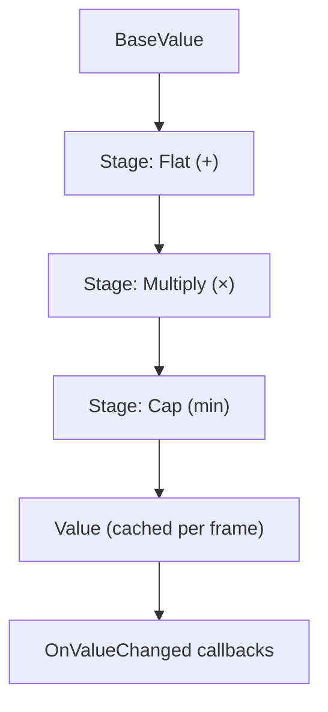
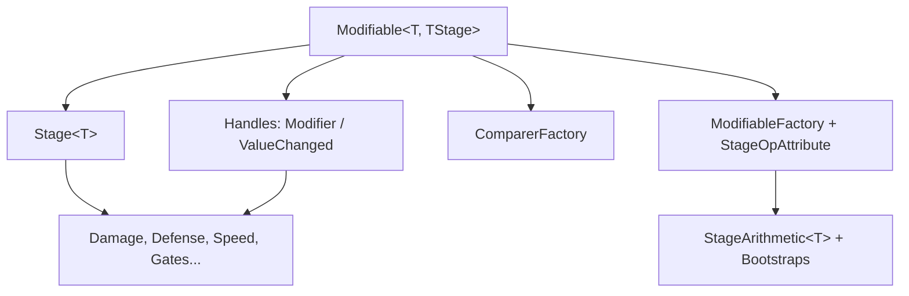

# ModifiableVariable

> Stackable, ordered stat modifiers for Unity — base value in, gameplay-ready value out.

  

---

## 📦 Installation

Pick any one of these:

**1. Package Manager — Add from Git URL (recommended)**
`Window → Package Manager → + → Add package from git URL…`, then paste:

```text
https://github.com/SacraneScrny/ModifiableVariable.git#1.0.0
```

Omit `#1.0.0` to track the latest `main`.

**2. Via `manifest.json`**
Add this line to `Packages/manifest.json` in your Unity project:

```json
{
  "dependencies": {
    "com.sacranescrny.modifiablevariable": "https://github.com/SacraneScrny/ModifiableVariable.git#1.0.0"
  }
}
```

**3. Manual copy**
Download the [ZIP](https://github.com/SacraneScrny/ModifiableVariable/archive/refs/heads/main.zip) (or clone the repo) and copy the folder into your project as `Assets/ModifiableVariable` (classic `.unitypackage`-style install) or `Packages/ModifiableVariable` (embedded package).

> Requirements: Unity 2021.3+, no external dependencies. Do not delete the `.meta` files — the package breaks without them.

---

## 🎮 What It Does

`ModifiableVariable` replaces hardcoded stat math with a **base value + ordered modifier pipeline**.

Buffs, debuffs, gear, and status effects stack in a predictable order (flat → mult → cap), recalculate only when needed, and notify UI/gameplay on change. One line reads the final value anywhere.


---

## ✨ Gameplay Use Cases

| Scenario | How it maps |
|---|---|
| ⚔️ Weapon damage + buffs | `DamageModifiable`: flat → multiply → penetration → cap |
| 🛡️ Armor / resistance | `DefenseModifiable`: flat → multiply → cap |
| 👟 Slow / haste effects | `SpeedModifiable`: flat → multiply → min/max clamp |
| ❤️ Max HP / mana scaling | `ResourceModifiable`: flat → multiply → regen → cap |
| 🎲 Crit / dodge chance | `ChanceModifiable`: flat → multiply → cap |
| ⏳ Cooldown reduction | `CooldownModifiable`: reduction → multiply → floor |
| 🚪 Can-attack / is-stunned gates | `Gate*Modifiable`: OR / AND / Override stages |
| 🎨 Tint, knockback, blends | `Color / Position / Rotation / Blend` pipelines |


Adding or removing a buff is one disposable handle — no manual recompute, no stale stats.

---

## 🧠 How It Works

A `Modifiable<T, TStage>` holds a **base value** and an **ordered list of stages**. Each stage folds its live modifier delegates (`Func<T>`) into the running value with one binary op (`+`, `×`, `min`, `OR`, `override`…).



Result is **computed on demand, cached per frame** (`Time.frameCount`), and change callbacks fire only when the value actually changes (epsilon-aware comparers for `float`/`Vector`).

---

## 🏗 System Overview



| Component | Purpose |
|---|---|
| `Modifiable<T, TStage>` | Base value, ordered stages, cached `Value`, callbacks. `Modifiable.cs:20` |
| `Stage<T>` | One pipeline step: folds modifiers with a `StageOp<T>`. `Stages/Stage.cs:12` |
| `StageOpAttribute` + enums | Declares pipeline order and op per stage (e.g. `Damage.Flat → Multiply → Penetration → Cap`). `Stages/StageFactory/DefaultStages.cs:57` |
| `StageArithmetic<T>` + Bootstraps | Registers real ops for `bool`, numerics, `Vector*`, `Color`, `Quaternion`, `Rect`, `Bounds…`; expression fallback otherwise. `Stages/StageFactory/StageArithmetic.cs:15` |
| `ComparerFactory` | Epsilon-aware equality so callbacks don't spam. `Comparers/ComparerFactory.cs:8` |
| `ModifierDelegateHandler` / `ValueChangedHandler` | `IDisposable` handles — disposing removes the modifier/callback. `Entities/` |
| `ModifiableDrawer` | Inspector shows **Base \| Result** side by side. `Editor/ModifiableDrawer.cs:13` |

Ready-made pipelines in `Modifiables.cs`: `Simple / General / Complex / Damage / Defense / Speed / Resource / Chance / Cooldown / Color / Position / Rotation / Overridable / Blend` + `Gate*` (bool) variants.

---

## 🚀 Quick Start

**Install:** see [📦 Installation](#-installation) above (Git URL, `manifest.json`, or manual copy). Ops auto-register on load via bootstraps.

```csharp
using ModifiableVariable;
using ModifiableVariable.Stages.StageFactory;

var attack = new DamageModifiable<float>(10f);

// Sword +5 (Flat), Rage x1.5 (Multiply). Handles remove the buff on Dispose.
using var sword = attack.Add(() => 5f, Damage.Flat);
using var rage  = attack.Add(() => 1.5f, Damage.Multiply);

float hit = attack.Value; // (10 + 5) * 1.5 = 22.5 — use it like a float
attack.Value = 12f;       // change base; modifiers re-apply automatically
```

React to changes (note: callback returns `T`):

```csharp
using var sub = attack.OnValueChanged(v => { damageLabel.text = v.ToString(); return v; });
```

<details>
<summary>Custom pipeline (your own order)</summary>

```csharp
using ModifiableVariable.Stages.StageFactory;

public enum MyStats
{
    [StageOp(StageOpKind.Add)]      Flat,
    [StageOp(StageOpKind.Multiply)] Mult,
    [StageOp(StageOpKind.Min)]      Cap,
}

var hp = new Modifiable<float, MyStats>(100f); // stages built from the attributes
using var gear = hp.Add(() => 20f, MyStats.Flat);
```

For unregistered `T` + op combos, add your own: `StageArithmetic<MyType>.Register(StageOpKind.Add, (a, b) => ...)`.
</details>

---

## 🎯 Example Gameplay Flow

**Raging warrior vs. armored knight:** base sword damage → rage multiplier → armor penetration → damage cap → enemy HP + UI update.


```csharp
var dmg = new DamageModifiable<float>(10f);
using var sword = dmg.Add(() => 5f, Damage.Flat);
using var rage  = dmg.Add(() => 1.5f, Damage.Multiply);
using var armor = dmg.Add(() => 3f, Damage.Penetration);
using var cap   = dmg.Add(() => 30f, Damage.Cap);

enemy.TakeDamage(dmg.Value); // (10 + 5) * 1.5 - 3 = 19.5, capped at 30
// Stun ends → just Dispose() the handle; next read is clean, no cleanup code.
```

Same pattern gates behavior: `GateModifiable` with `OR` buffs + `AND` requirements + `Override` stun — `if (canAct.Value) …`.

---

## 🔧 Configuration

| Setting | Purpose | Default |
|---|---|---|
| `BaseValue` / `Value` | Raw stat vs. final computed stat (implicit `T` conversion reads `Value`) | ctor arg |
| `Add(() => x, Stage)` | Live modifier — re-evaluated every recompute; `Dispose()` removes it | — |
| `OnValueChanged(v => …)` | Fires only on real change; must return `T` | — |
| `WithComparer(...)` | Custom equality (e.g. tighter float epsilon) | Built-ins for `float/int/Vector*/Color*/Quaternion` |
| `Count` / `Clear()` / `Dispose()` | Inspect, reset modifiers + base, tear down | — |
| `StageArithmetic<T>.Register(kind, op)` | Teach a type a new op (`Lerp` is fixed `t=0.5` for built-ins) | Bootstraps cover common Unity types |

---

## 🧩 Extending It

- **New stat:** define a `TStage` enum with `[StageOp(...)]` members → `new Modifiable<float, MyEnum>(base)`.
- **New type support:** `StageArithmetic<MyStruct>.Register(StageOpKind.Add, (a, b) => …)`.
- **New gameplay hook:** `OnValueChanged` drives health bars, AI blackboards, quest checks.
- **Temporary effects:** keep the `ModifierDelegateHandler` from `Add()`; `Dispose()` on buff expiry.

---

## 📁 Project Structure

```text
ModifiableVariable/
├── Modifiable.cs        # Core: base value, stages, cached Value, callbacks
├── Modifiables.cs       # Ready-made pipelines (Damage, Defense, Speed, Gates...)
├── Stages/
│   ├── Stage.cs         # Single fold step
│   └── StageFactory/    # StageOpAttribute, DefaultStages enums, arithmetic + bootstraps
├── Entities/            # Modifier / ValueChanged delegates + disposable handles
├── Comparers/           # Epsilon-aware equality per type
└── Editor/              # Inspector Base | Result drawer
```

---

## ⚠️ Limitations

- Unity-only (`Time.frameCount` caching, `Debug`, `RuntimeInitializeOnLoadMethod`).
- Reading `Value` while it is being computed, or mutating from inside a modifier/callback, throws — keep modifiers pure.
- A stage whose op isn't registered for `T` is skipped with a warning; unregistered types rely on expression compilation, which may fail on AOT/IL2CPP/WebGL — prefer explicit `Register`.
- `Lerp` built-ins blend at fixed `t = 0.5`; several Unity structs (e.g. `Color32`, `Rect`, `Bounds`) expose only a subset of ops.
- Modifiers are runtime delegates (not serialized); the Inspector shows Base + computed Result only.

---

## 📄 License

MIT — see [LICENSE](LICENSE).
