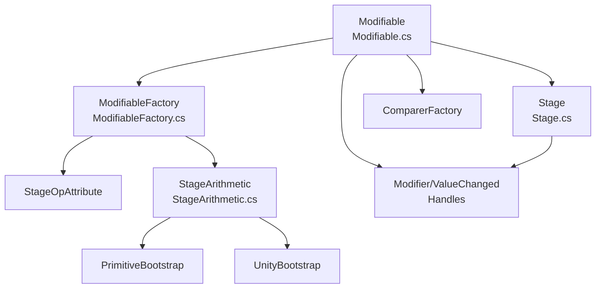
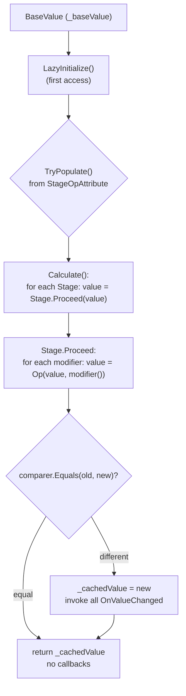

# ModifiableVariable — Technical README

> In-depth technical documentation: how the `base value → stages → cached Value` pipeline works, what each class is made of, how operations are registered, how values are cached, and what the limitations are.
> User overview and quick start live in `README.md`. This file is the shelf-by-shelf breakdown for people who will extend, debug, and review the system.

**Language:** English. **Code:** C# / Unity. **Assembly (asmdef):** `ModifiableVariables`.

---

## Contents

- [1. Mental model and glossary](#1-mental-model-and-glossary)
- [2. Repository map](#2-repository-map)
- [3. Value lifecycle](#3-value-lifecycle)
- [4. Core: `Modifiable<T, TStage>`](#4-core-modifiablet-tstage)
- [5. Pipeline step: `Stage<T>` and `StageOp<T>`](#5-pipeline-step-staget-and-stageopt)
- [6. Operation kinds: `StageOpKind`](#6-operation-kinds-stageopkind)
- [7. Operation registry: `StageArithmetic<T>`](#7-operation-registry-stagearithmetict)
- [8. Operation auto-registration: Bootstrap classes](#8-operation-auto-registration-bootstrap-classes)
- [9. Pipeline assembly: `ModifiableFactory` + `StageOpAttribute`](#9-pipeline-assembly-modifiablefactory--stageopattribute)
- [10. Built-in pipelines: `DefaultStages.cs`](#10-built-in-pipelines-defaultstagescs)
- [11. Ready-made classes: `Modifiables.cs`](#11-ready-made-classes-modifiablescs)
- [12. Delegates and handles: `Entities/`](#12-delegates-and-handles-entities)
- [13. Value comparison: `Comparers/`](#13-value-comparison-comparers)
- [14. Inspector: `Editor/ModifiableDrawer.cs`](#14-inspector-editormodifiabledrawercs)
- [15. Caching, invalidation, and reentrancy](#15-caching-invalidation-and-reentrancy)
- [16. Exceptions, warnings, and diagnostics](#16-exceptions-warnings-and-diagnostics)
- [17. Limitations (honest list)](#17-limitations-honest-list)
- [18. Extension recipes](#18-extension-recipes)
- [19. Code examples](#19-code-examples)
- [20. FAQ / Pitfalls](#20-faq--pitfalls)

---

## 1. Mental model and glossary

### 1.1. One formula for the whole system

```
Value = Fold_n( ... Fold_2(Fold_1(BaseValue)) ... )
Fold_k(x) = Op_k(x, m1) |> Op_k(x, m2) |> ... |> Op_k(x, mN)
```

- `BaseValue` — the raw stat (sword damage, speed, chance).
- `Stage` — one ordered step (`Flat`, `Multiply`, `Cap`, …).
- `Op_k` — **a single** binary operation for the whole stage (`+`, `×`, `min`, `OR`, `override`, …).
- `m1..mN` — live stage modifiers, each a `Func<T>` (`ModifierDelegate<T>`).
- `Value` — the cached result of the full pipeline.

Stage order is defined by the **declaration order of the enum** (`DefaultStages.cs:57` or your own enum).

### 1.2. Glossary

| Term | What it is | Where in code |
|---|---|---|
| `BaseValue` | Field `_baseValue`, serialized. The `Value = x` setter changes exactly this | `Modifiable.cs:24,132` |
| `Value` | Getter = recompute + cache; setter = change base | `Modifiable.cs:132` |
| `Stage` | One `fold` with a fixed `Op` and a list of `ModifierDelegate<T>` | `Stages/Stage.cs:12` |
| `StageOp<T>` | Delegate `T (T a, T b)` — "running value + modifier" | `Stages/StageOp.cs:4` |
| `StageOpKind` | Operation name (`Add`, `Multiply`, `Min`, `Or`, …) | `Stages/StageFactory/ModifiableFactory.cs:73` |
| `StageOpAttribute` | Binding "enum member → `StageOpKind`" | `Stages/StageFactory/StageOpAttribute.cs:8` |
| `Modifier` | `delegate T ModifierDelegate<T>()` — a live value supplier | `Entities/ModifierDelegate.cs:4` |
| `ModifierDelegateHandler<T>` | `IDisposable` handle: `Dispose()` removes the modifier | `Entities/ModifierDelegateHandler.cs:9` |
| `ValueChanged*` | Callback `T (T newValue)` + unsubscribe handle | `Entities/ValueChanged*.cs` |
| `Comparer` | `IEqualityComparer<T>` answering "did it really change?" | `Comparers/ComparerFactory.cs:8` |

### 1.3. One-line example

```csharp
var attack = new DamageModifiable<float>(10f);
using var sword = attack.Add(() => 5f, Damage.Flat);      // +5
using var rage  = attack.Add(() => 1.5f, Damage.Multiply); // x1.5
float hit = attack.Value; // (10 + 5) * 1.5 = 22.5
// leaving the using scope → Dispose() → modifier removed, next Value is clean
```

---

## 2. Repository map

```text
ModifiableVariable/
├── Modifiable.cs                  # Core: base, stages, cached Value, callbacks, Dispose
├── Modifiables.cs                 # 18 ready-made wrapper classes (Damage, Speed, Gate*, …)
├── ModifiableVariables.asmdef     # Assembly Definition: ModifiableVariables
├── Stages/
│   ├── Stage.cs                   # One step: List<Modifier> + Op, Proceed(), Clear/Dispose
│   ├── StageOp.cs                 # delegate T StageOp<T>(T a, T b)
│   └── StageFactory/
│       ├── StageOpAttribute.cs              # [StageOp(Kind)] on enum members
│       ├── ModifiableFactory.cs             # TryPopulate() + StageOpKind enum
│       ├── StageArithmetic.cs               # Op registry per (T, Kind) + Expression fallback
│       ├── StageArithmeticPrimitiveBootstrap.cs # bool/int/uint/long/float/double
│       └── StageArithmeticUnityBootstrap.cs     # Vector*/Color*/Quaternion/Rect/Bounds/…
│       └── DefaultStages.cs                 # 18 enum pipelines with attributes
├── Entities/
│   ├── ModifierDelegate.cs        # delegate T ModifierDelegate<out T>()
│   ├── ModifierDelegateHandler.cs # struct IDisposable that removes a modifier
│   ├── ValueChangedDelegate.cs    # delegate T ValueChangedDelegate<T>(T v)
│   └── ValueChangedHandler.cs     # struct IDisposable that unsubscribes a callback
├── Comparers/
│   ├── ComparerFactory.cs         # Register<T>/Get<T>, 10 built-in comparers
│   └── DefaultComparers.cs        # Float/Int/Vector*/Color*/Quaternion
└── Editor/
    └── ModifiableDrawer.cs        # CustomPropertyDrawer: Base | Result
```

Dependencies (who knows whom):



---

## 3. Value lifecycle

### 3.1. Flow diagram



### 3.2. Step by step

1. **Creation.** The constructor stores `baseValue` in `_baseValue`, `_cachedValue`, and `_defaultValue`, then calls `Invalidate()`. Stages are **not created yet** if the short `Modifiable(base)` constructor was used — they appear lazily (see §4.3).
2. **First access** (`Value`, `Add`, `Remove`, `OnValueChanged`, `WithComparer`, `Value` setter). `LazyInitialize()` runs: if `_stages` is empty, `ModifiableFactory.TryPopulate(this)` builds stages from the enum.
3. **Recompute** (`Calculate()`, `Modifiable.cs:325`). Takes `_baseValue` and runs it through `_stages` in order. Each `Stage.Proceed()` (`Stage.cs:71`) re-invokes **all live** `modifier()` delegates and folds them with its `Op`.
4. **Cache.** The result is compared to `_cachedValue` via `_comparer`. If equal — callbacks are **not fired**. If different — `_cachedValue` is updated and all `_valueChangedCallbacks` run.
5. **Invalidation.** Any change (new/removed modifier, base change, `AddStage`, `Clear`, comparer change) sets `_cachedFrame = -1` and `_modifiersHasChanged = true`. The next `Value` read recomputes.
6. **Effect removal.** Handle `Dispose()` → `Stage.HandleRemove()` → `Remove()` + `HandleStageRemoved` event → `Modifiable.Invalidate()`. The next `Value` is already clean.

### 3.3. What "live modifier" means

`Add(() => currentBonus, ...)` stores the **delegate**, not the number. Every `Calculate()` invokes the delegate again:

```csharp
float bonus = 5f;
using var h = attack.Add(() => bonus, Damage.Flat);
bonus = 10f; // next attack.Value already accounts for 10, no re-Add needed
```

Consequence: modifiers must be **pure** (no side effects, no mutation of the same `Modifiable` — that throws, see §15.3).

---

## 4. Core: `Modifiable<T, TStage>`

File: `Modifiable.cs:20`. Generic class, `where TStage : Enum`, `IDisposable`, `[Serializable]`.

### 4.1. Fields (internal state)

| Field | Type | Purpose |
|---|---|---|
| `_baseValue` | `T` (`[SerializeField]`) | The only serialized field. Recompute source |
| `_cachedValue` | `T` | Last computed `Value` |
| `_defaultValue` + `_hasDefault` | `T` + `bool` | Constructor-time base snapshot. `Clear()` rolls `_baseValue` back to it (§4.7) |
| `_stages` | `List<Stage<T>>` | Evaluation order = list order |
| `_stageMap` | `Dictionary<int, Stage<T>>` | Fast `TStage → Stage` lookup. Key is `Convert.ToInt32(stage)` |
| `_valueChangedCallbacks` | `List<ValueChangedDelegate<T>>` | Change subscribers |
| `_comparer` | `IEqualityComparer<T>` | From `ComparerFactory.Get<T>()`, replaced via `WithComparer()` |
| `_cachedFrame` | `int` | `Time.frameCount` of the last recompute; `-1` = "dirty" |
| `_modifiersHasChanged` | `bool` | Second dirty flag (modifiers changed within the frame) |
| `_cachedCount` | `int` | Cached `Count` (sum of `Modifiers.Count`), refreshed in `Invalidate()` |
| `_recalculateValueGuard` | `bool` | `true` inside `Calculate()` — reentrancy guard |
| `_disposed` | `bool` | After `Dispose()`, any operation throws `ObjectDisposedException` |
| `_hasInited` | `bool` | Whether `LazyInitialize()` has run |

### 4.2. Constructors

```csharp
// 4.2.1. Explicit stages — no lazy magic, full control
public Modifiable(T baseValue, params (TStage, StageOp<T>)[] stages)

// 4.2.2. Implicit stages — built from [StageOp] on TStage on first access
public Modifiable(T baseValue)
```

Both: take the comparer from the factory, store `baseValue` in `_baseValue`/`_cachedValue`/`_defaultValue`, call `Invalidate()`.

> Note: `params (TStage, StageOp<T>)[]` is a `(key, operation)` tuple. Internally it calls `AddStage()` for each entry (§4.4).

### 4.3. Lazy initialization

```csharp
void LazyInitialize() // Modifiable.cs:443
```

- Called from: `Value` getter/setter, `Add`, all `Remove` overloads, `OnValueChanged`, `WithComparer`.
- If `_hasInited == false`:
  1. Freezes `_defaultValue` (if not yet set).
  2. Ensures the comparer (`??= ComparerFactory.Get<T>()`).
  3. If `_stages.Count == 0` — calls `ModifiableFactory.TryPopulate(this)`.
  4. If the factory returns `false` (no attributes / no available operations) — throws `InvalidOperationException` hinting at `StageOpAttribute`.
- Then sets `_hasInited = true`. Never runs twice.

Implication: **a bare `new Modifiable<float, MyEnum>(x)` with an attribute-less enum fails not in the constructor but on first read/write** — important for debugging.

### 4.4. Stage management: `AddStage`

```csharp
public Modifiable<T,TStage> AddStage(StageOp<T> op, TStage stage) // Modifiable.cs:94
public Modifiable<T,TStage> AddStage((TStage, StageOp<T>) stage)  // Modifiable.cs:115
```

- Creates `new Stage<T>(op)`, subscribes `s.HandleStageRemoved += Invalidate`.
- Appends to `_stages` (order = call order) and to `_stageMap`.
- **Duplicate key:** if this `TStage` already exists, the old stage is removed from the list (with `Debug.LogWarning`) and replaced. The map entry is overwritten.
- Returns `this` (chaining).
- Throws on disposed instance, `op == null`, or reentrancy.

### 4.5. Reading and writing: the `Value` property

#### 4.5.1. Setter (`Value = x`)

```csharp
// Modifiable.cs:134
if (_comparer.Equals(_baseValue, value)) return; // no change — no invalidation
_baseValue = value;
Invalidate();
```

Changes **only the base**; modifiers are kept and re-applied on the next read.

#### 4.5.2. Getter (full algorithm)

```csharp
// Modifiable.cs:147 — simplified
if (_disposed) throw ...;
LazyInitialize();
if (_recalculateValueGuard) return _cachedValue;          // (A) reentrant read
if (!IsFrameDirty() && !IsModifiersHasChanged())           // (B) cache is valid
    return _cachedValue;
_recalculateValueGuard = true;
try {
    value = Calculate();                                   // (C) recompute
    if (!_comparer.Equals(_cachedValue, value)) {          // (D) did it really change?
        _cachedValue = value;
        foreach (cb in _valueChangedCallbacks) cb(value);  // (E) notify
    }
    ClearFrameDirty(); ClearModifiersChanged();            // (F) stamp the frame
} catch (Exception e) {
    Debug.LogException(e);                                 // (G) don't crash the game
    return _cachedValue;                                   //     return the old value
} finally {
    _recalculateValueGuard = false;
}
return value;
```

Breakdown:

- **(A)** Reading `Value` **inside** a modifier/callback does not throw; it returns the stale `_cachedValue` (recursion protection).
- **(B)** Two cache conditions: `Time.frameCount != _cachedFrame` **OR** `_modifiersHasChanged`. If nothing changed within the same frame — no recompute at all (O(1)).
- **(C–D)** Comparison uses `_comparer`, not `==`. For `float` that is epsilon-based (`FloatComparer`, 0.0001), so jitter does not spam callbacks.
- **(E)** Callbacks run **synchronously**, in subscription order, only on a real change.
- **(G)** Any exception from `Calculate()`/callbacks is logged and swallowed — the getter returns the previous value. This saves runtime but hides bugs: watch the console.

#### 4.5.3. `GetValueEditor()` (`UNITY_EDITOR` only)

```csharp
public T GetValueEditor() { return Calculate(); } // Modifiable.cs:124
```

- Direct `Calculate()` with **no** cache, guards, or callbacks. Used by `ModifiableDrawer` for the Result column.
- Since modifiers are runtime delegates (not serialized), in the editor without Play Mode the stages are usually empty → Result == Base.

### 4.6. Modifiers: `Add` / `Remove`

```csharp
public ModifierDelegateHandler<T> Add(ModifierDelegate<T> modifier, TStage stage = default)
public bool Remove(ModifierDelegate<T> modifier, TStage stage)
public bool Remove(ModifierDelegateHandler<T> handler, TStage stage)
public bool Remove(ModifierDelegate<T> modifier)          // search across all stages
public bool Remove(ModifierDelegateHandler<T> modifier)  // same by handle
```

- `Add`:
  - `stage = default` = the zero enum value = **the first member** (with default values). Beginners often forget the stage and put everything into `Flat` — check this.
  - `LazyInitialize()` → stage lookup (`GetStage`, throws `KeyNotFoundException`/`InvalidOperationException`) → `Invalidate()` → `foundStage.Add(modifier)` → return the handle.
  - `modifier == null` → `ArgumentNullException`.
- `Remove(stage)` — targeted removal from one stage, returns `List.Remove`'s `bool`.
- `Remove(without stage)` — linear scan of `_stages`, removes from the **first** containing stage, `break`. Cleans `null`/disposed stages along the way. `Invalidate()` only if something was actually removed.
- Every mutation under `_recalculateValueGuard` → `InvalidOperationException` (see §15.3).

### 4.7. `Clear()`, `Count`, `Dispose()`

| Method | Behavior (`Modifiable.cs:306,404,430`) |
|---|---|
| `Clear()` | `Invalidate()` → `Stage.Clear()` for every live stage → `_baseValue = _defaultValue` (if `_hasDefault`). That is, the base rolls back to the **constructor** value, not the current one. Callbacks are **kept** |
| `Count` | Getter returns `_cachedCount` — refreshed only in `Invalidate()`/`UpdateCount()`, not live. After `Dispose()` it is 0 |
| `Dispose()` | `_disposed = true`, callbacks cleared, every stage disposed, lists/maps cleared, flags reset. Second call is a no-op. Calling it during computation throws |

### 4.8. Subscriptions: `OnValueChanged`

```csharp
public ValueChangedHandler<T> OnValueChanged(ValueChangedDelegate<T> callback) // Modifiable.cs:291
```

- Appends to `_valueChangedCallbacks`, returns a `ValueChangedHandler<T>` for unsubscribing via `Dispose()`.
- Unsubscribing during computation throws (the closure checks `_recalculateValueGuard`).
- The `T Callback(T newValue)` signature forces a `return`: the return value is **ignored** by the core (the call is `cb(value)` with the result discarded), but the compiler still requires it:

```csharp
using var sub = attack.OnValueChanged(v => { label.text = v.ToString(); return v; });
```

### 4.9. Comparer and implicit operators

```csharp
public Modifiable<T,TStage> WithComparer(IEqualityComparer<T> comparer) // Modifiable.cs:82
// — null → ArgumentNullException; reentrancy → InvalidOperationException
// — LazyInitialize() + Invalidate() + return this (chaining)

public static implicit operator T(Modifiable<T,TStage> obj) => obj.Value; // Modifiable.cs:392
public static implicit operator Modifiable<T,TStage>(T obj) => new(obj);  // Modifiable.cs:399
```

- `WithComparer` — e.g. a tighter `new FloatComparer(1e-6f)`.
- `implicit operator T` allows `float hit = attack;` and passing `attack` into `TakeDamage(T)`.
- `implicit operator Modifiable<T,TStage>(T)` creates an object **without explicit stages** — they arrive via `LazyInitialize` on first use.

---

## 5. Pipeline step: `Stage<T>` and `StageOp<T>`

### 5.1. `StageOp<T>` — one line

```csharp
public delegate T StageOp<T>(T a, T b); // Stages/StageOp.cs:4
```

`a` is the accumulated value, `b` is the next modifier. Examples: `(a,b) => a + b`, `Mathf.Min`, `(a,b) => b` (override), `(a,b) => a | b`.

### 5.2. `Stage<T>` — fields and methods (`Stages/Stage.cs`)

| Member | Line | Meaning |
|---|---|---|
| `Op` | `Stage.cs:18` | `readonly`, set in the constructor, immutable |
| `_modifiers` / `Modifiers` | `:19,22` | Live list; the getter throws after `Dispose()` |
| `Add(Func<T>)` / `Add(ModifierDelegate<T>)` | `:37,45` | `internal`; wraps `Func<T>` into a `ModifierDelegate`, appends, returns a handle bound to `HandleRemove` |
| `HandleRemove` | `:52` | `internal`; `Remove()` plus `HandleStageRemoved?.Invoke()` on success (which is `Modifiable.Invalidate()`) |
| `Remove(...)` | `:60,66` | `internal`; `List.Remove`, `bool` |
| `Proceed(T baseValue)` | `:71` | `internal`; `for: value = Op(value, mod())`. An empty list returns the input unchanged |
| `Clear()` | `:83` | Clears the list; throws after `Dispose()` |
| `Dispose()` | `:88` | `Clear()` + `_disposed = true` + `HandleStageRemoved = null` |
| `HandleStageRemoved` | `:96` | `internal event Action`; the "stage → core invalidation" bridge |

### 5.3. Important consequences

1. **Modifier order within a stage = `Add` order.** Irrelevant for commutative ops (`Add`, `Or`); critical for non-commutative ones (`Subtract`, `Override`, `Divide`). The last `Override` wins.
2. **`internal` visibility** of `Add/Remove/Proceed` means: from the outside a stage is driven only through `Modifiable.Add/Remove/Clear`. You can `new Stage<T>(op)` directly (public constructor), but only `AddStage` wires it into a pipeline.
3. **Double invalidation on `Add` is normal.** `Modifiable.Add()` calls `Invalidate()` before `Stage.Add()`, and handle `Dispose` triggers another one via the event. The flags are idempotent.
4. **Exceptions from `modifier()`** propagate through `Proceed` → `Calculate` and are absorbed by the `Value` getter (`LogException` + old value).

---

## 6. Operation kinds: `StageOpKind`

Declared in `Stages/StageFactory/ModifiableFactory.cs:73`.

| `Kind` | Meaning | Typical pipeline use |
|---|---|---|
| `Add` | `a + b` | `Flat`, `Offset`, `Overlay`, `Regen`, `Post` |
| `Subtract` | `a - b` | `Penetration` (damage), `Reduction` (cooldown) |
| `Multiply` | `a * b` | `Multiply`, `Tint`, `Scale` (for `Vector2/3` — per-component `Scale`) |
| `Divide` | `a / b` | Rare; registered for primitives only |
| `Min` | `min(a, b)` | `Cap`, `Max` (upper bound): each modifier is a ceiling candidate, the strictest wins |
| `Max` | `max(a, b)` | `Min`, `Floor` (lower bound): likewise, the highest floor wins |
| `Override` | `b` (ignores `a`) | `Override`: the last modifier wins; the only op available **for any `T` out of the box** |
| `Lerp` | `lerp(a, b, 0.5)` | `Blend.Lerp`: fixed `t = 0.5` (see §17) |
| `Scale` | _reserved_ | **Registered nowhere** — requires manual `Register` (§18.2) |
| `Or` | `a \| b` | `Gate*.DisjunctionState`: any `true` raises it |
| `And` | `a \& b` | `Gate*.ConjunctionState`: any `false` drops it |

> `Scale` exists in the enum but no Bootstrap registers it. An enum using `[StageOp(StageOpKind.Scale)]` without manual registration gets a **skipped stage with a warning** (§9.3).

---

## 7. Operation registry: `StageArithmetic<T>`

File: `Stages/StageFactory/StageArithmetic.cs:15`. A static generic registry — one dictionary per `T`.

### 7.1. Layout

```csharp
static readonly Dictionary<StageOpKind, StageOp<T>> _ops = new();
readonly static HashSet<StageOpKind> _fallbackTried = new();
static StageArithmetic() { Register(Override, (a,b) => b); } // Override always exists
public static StageOp<T> Get(StageOpKind kind)   // hit → return; miss → CompileFallback
public static void Register(StageOpKind kind, StageOp<T> op) // _ops[kind] = op (replace)
```

### 7.2. Expression fallback (`CompileFallback`, `:37`)

1. If this `kind` was already attempted (`_fallbackTried`) — return whatever is there (possibly `null`), no repeated warnings.
2. `GetExpressionFactory(kind)` knows only 4 kinds: `Add → Expression.Add`, `Subtract → Subtract`, `Multiply → Multiply`, `Divide → Divide`. Everything else (`Min/Max/Lerp/Or/And/Scale/Override`) → `null` → warning "No expression factory… Register it explicitly".
3. With a factory: `Expression.Lambda<StageOp<T>>(factory(a,b), a, b).Compile()`. Success → cache in `_ops` + AOT/IL2CPP warning. Failure (missing operator, AOT) → warning with `e.Message`, return `null`.

### 7.3. What follows from this

- For **your own struct with `operator +`/`-`/`*`/`/`** the first 4 operations may "magically" resolve in Editor/Standalone but **break on IL2CPP/WebGL**. Rule: always `Register` explicitly for production (§18.2).
- `Override` works for **any** `T` with no registration (static constructor).
- `Min/Max/Lerp/Or/And/Scale` without an explicit `Register` are always `null` → the stage is skipped (§9.3).

---

## 8. Operation auto-registration: Bootstrap classes

Both are `static` with `Init()` marked `[RuntimeInitializeOnLoadMethod(SubsystemRegistration)]`. They run at runtime load, **before the first `TryPopulate`**. In Edit Mode without Play Mode the initialization may not have run — keep that in mind for out-of-Play tests.

### 8.1. `StageArithmeticPrimitiveBootstrap` (`...PrimitiveBootstrap.cs:10`)

| `T` | Registered |
|---|---|
| `bool` | `Override: (a,b)=>b`, `Or: a\|b`, `And: a&b` |
| `int`, `uint`, `long` | `Add/Sub/Multiply/Divide`, `Min/Max` (`Math.Min/Max`), `Override` |
| `float` | `Add/Sub/Multiply/Divide`, `Min/Max` (`Mathf.Min/Max`), `Lerp: Lerp(a,b,0.5)`, `Override` |
| `double` | `Add/Sub/Multiply/Divide`, `Min/Max` (`Math.Min/Max`), `Lerp: a+(b-a)*0.5`, `Override` |

**Missing**: `Scale` (everywhere), `Lerp` for integers, `Or/And` for non-`bool`.

### 8.2. `StageArithmeticUnityBootstrap` (`...UnityBootstrap.cs:10`)

| `T` | `Add` | `Subtract` | `Multiply` | `Min` | `Max` | `Lerp (t=0.5)` | `Override` | Notes |
|---|---|---|---|---|---|---|---|---|
| `Vector2` | `+` | `-` | `Vector2.Scale` | `Min` | `Max` | `Lerp` | `b` | — |
| `Vector2Int` | `+` | `-` | `a*b` | `Min` | `Max` | — | `b` | no `Lerp` |
| `Vector3` | `+` | `-` | `Vector3.Scale` | `Min` | `Max` | `Lerp` | `b` | — |
| `Vector3Int` | `+` | `-` | `a*b` | `Min` | `Max` | — | `b` | no `Lerp` |
| `Vector4` | `+` | `-` | — | `Min` | `Max` | `Lerp` | `b` | **no `Multiply`** |
| `Color` | `+` | `-` | `a*b` | — | — | `Lerp` | `b` | no `Min/Max` |
| `Color32` | — | — | — | — | — | `Lerp` | `b` | **only 2 ops** |
| `Quaternion` | — | — | `a*b` | — | — | `Slerp` | `b` | `Lerp→Slerp` |
| `Rect` | per-comp. `+` | — | — | per-comp. `Min` | per-comp. `Max` | — | `b` | custom lambdas |
| `Bounds` | `center+size` | — | — | — | `Encapsulate` | — | `b` | `Max` = union |
| `BoundsInt` | `pos+size` | — | — | — | — | — | `b` | — |
| `Matrix4x4` | — | — | `a*b` | — | — | — | `b` | — |

Missing everywhere: `Divide` for Unity types, `Scale`, `Or/And` for non-`bool`.

> Review takeaway: a `DamageModifiable<Vector4>` silently skips the `Multiply` stage (no registration) while `Penetration(Subtract)` and `Cap(Min)` work. Check the tables, not your intuition.

---

## 9. Pipeline assembly: `ModifiableFactory` + `StageOpAttribute`

### 9.1. `StageOpAttribute` (`StageOpAttribute.cs:8`)

```csharp
[AttributeUsage(AttributeTargets.Field)]
public class StageOpAttribute : Attribute {
    public readonly StageOpKind Kind;
    public StageOpAttribute(StageOpKind kind) => Kind = kind;
}
```

Attached to an **enum member**:

```csharp
public enum Damage {
    [StageOp(StageOpKind.Add)]      Flat,
    [StageOp(StageOpKind.Multiply)] Multiply,
    [StageOp(StageOpKind.Subtract)] Penetration,
    [StageOp(StageOpKind.Min)]      Cap,
}
```

### 9.2. `TryPopulate` (`ModifiableFactory.cs:18`)

```csharp
public static bool TryPopulate<T, TStage>(Modifiable<T,TStage> modifiable) where TStage : Enum
```

Algorithm:

1. `values = Enum.GetValues(typeof(TStage))` — order = declaration order (with default values).
2. `TryGetOps<TStage>()` — reflection `GetField(name).GetCustomAttribute<StageOpAttribute>()` per member; a member without the attribute defaults to `StageOpKind.Add`. The result is cached in `_cache` (once per enum type). If **no** member carries the attribute → `null` → warning "No StageOpAttribute…" → `return false`.
3. For each `(values[i], ops[i])`: `StageArithmetic<T>.Get(ops[i])`. Success → `modifiable.AddStage(s, values[i])`, `hasAny = true`. Failure (`null`) → `continue` + warning "No {op} operation available for type {T}. Stage {member}".
4. If nothing was assembled → warning "Stages is empty" → `return false` → the caller (`LazyInitialize`) throws `InvalidOperationException`.

### 9.3. Three assembly outcomes

| Situation | Behavior |
|---|---|
| All ops found | Full pipeline, `return true` |
| Some ops missing (e.g. `Multiply` for `Vector4`) | **Partial** pipeline: missing stages skipped, the rest work. One warning per skip |
| No attributes at all / no op found | `return false` → `LazyInitialize` throws on first access |

---

## 10. Built-in pipelines: `DefaultStages.cs`

File: `Stages/StageFactory/DefaultStages.cs`. The order below is the evaluation order.

### 10.1. Boolean gates (`bool`)

| Enum | Step 1 | Step 2 | Step 3 | Step 4 | Formula |
|---|---|---|---|---|---|
| `GateDisjunction` | `DisjunctionState [Or]` | `Override [Override]` | — | — | `result = override? o : (base \| o1 \| o2 …)` |
| `GateConjunction` | `ConjunctionState [And]` | `Override` | — | — | `result = override? o : (base \& c1 \& …)` |
| `GateGeneral` | `DisjunctionState [Or]` | `ConjunctionState [And]` | `Override` | — | `((base \| …) \& …)` then override |
| `GateComplex` | `DisjunctionState [Or]` | `ConjunctionState [And]` | `LastDisjunctionState [Or]` | `Override` | `(((base \| …) \& …) \| …)` then override |

How to read gates (`GateGeneral`, `base = false`):

- `Add(() => true, DisjunctionState)` — "a buff permits": `false | true = true`.
- `Add(() => false, ConjunctionState)` — "a debuff denies": `true & false = false`.
- `Add(() => true, Override)` — "stun/cutscene overrides everything": result is `true` regardless of earlier stages.
- Without `Override` modifiers there is no overriding; the gate result is honest.
- Multiple `Override`s: the **last added** wins.

### 10.2. Numeric pipelines

| Enum | Stage order | Formula (pseudo) | Notes |
|---|---|---|---|
| `Simple` | `Flat [Add]` | `base + Σflat` | One step, minimum surprise |
| `General` | `Flat [Add]` → `Multiply [×]` | `(base + Σf) × Πm` | Base of all `Modifiable<T>` |
| `Complex` | `Flat [Add]` → `Multiply [×]` → `Post [Add]` | `(base + Σf) × Πm + Σp` | `Post` is a flat bonus after scaling (e.g. fixed damage on top of %) |
| `Damage` | `Flat [+]` → `Multiply [×]` → `Penetration [−]` → `Cap [Min]` | `min((base+Σf)×Πm − Σpen, cap₁, cap₂…)` | Multiple `Cap`s → the strictest wins |
| `Defense` | `Flat [+]` → `Multiply [×]` → `Cap [Min]` | `min((base+Σf)×Πm, caps…)` | |
| `Speed` | `Flat [+]` → `Multiply [×]` → `Min [Max]` → `Max [Min]` | `min(max((base+Σf)×Πm, floors…), ceils…)` | **Names are misleading**: member `Min` has kind `Max` (floor), member `Max` has kind `Min` (ceiling). `Add(() => 2, Speed.Min)` = "no lower than 2", `Add(() => 9, Speed.Max)` = "no higher than 9" |
| `Resource` | `Flat [+]` → `Multiply [×]` → `Regen [Add]` → `Cap [Min]` | `min((base+Σf)×Πm + Σregen, caps…)` | `Regen` is a flat inflow after scaling |
| `Chance` | `Flat [+]` → `Multiply [×]` → `Cap [Min]` | `min((base+Σf)×Πm, caps…)` | Cap is usually `1.0` / `100` |
| `Cooldown` | `Reduction [−]` → `Multiply [×]` → `Floor [Max]` | `max((base−Σred)×Πm, floors…)` | `Reduction` subtracts, `Floor` keeps it from going below (e.g. a 0.5s global minimum) |

### 10.3. Space, color, blends

| Enum | Order | Step meaning |
|---|---|---|
| `ColorModificator` | `Tint [×]` → `Overlay [Add]` → `Override` | Tint, then additive overlay, then hard replace |
| `Position` | `Offset [Add]` → `Scale [×]` | Note: `+` first, then `×`: `(base + off) * scale`. For `base*scale + off` define your own enum |
| `Rotation` | `Multiply [×]` → `Override` | Quaternion composition `a*b`, then replace |
| `Overridable` | `Override` | Single "last wins" step — stances, states, priority effects |
| `Blend` | `Offset [Add]` → `Lerp` → `Override` | Offset, then half-blends (`t=0.5`) with each modifier in turn, then replace |

> `Blend.Lerp` with several modifiers is sequential `lerp(v, m, 0.5)`, not an arithmetic mean. Add order affects the result. Three modifiers `m1,m2,m3`: `lerp(lerp(lerp(v,m1,.5),m2,.5),m3,.5)`.

---

## 11. Ready-made classes: `Modifiables.cs`

Each is a thin `Modifiable<T, TStageEnum>` wrapper with two constructors `(base)` / `(base, params stages)` and a pair of `implicit` operators (§4.9). File: `Modifiables.cs`.

| Class | Enum | `T` |
|---|---|---|
| `GateModifiable` | `GateGeneral` | `bool` (fixed) |
| `GateConjunctionModifiable` | `GateConjunction` | `bool` |
| `GateDisjunctionModifiable` | `GateDisjunction` | `bool` |
| `GateComplexModifiable` | `GateComplex` | `bool` |
| `Modifiable<T>` | `General` | generic |
| `SimpleModifiable<T>` | `Simple` | generic |
| `ComplexModifiable<T>` | `Complex` | generic |
| `DamageModifiable<T>` | `Damage` | generic |
| `DefenseModifiable<T>` | `Defense` | generic |
| `SpeedModifiable<T>` | `Speed` | generic |
| `ResourceModifiable<T>` | `Resource` | generic |
| `ChanceModifiable<T>` | `Chance` | generic |
| `CooldownModifiable<T>` | `Cooldown` | generic |
| `ColorModifiable<T>` | `ColorModificator` | generic |
| `PositionModifiable<T>` | `Position` | generic |
| `RotationModifiable<T>` | `Rotation` | generic |
| `OverridableModifiable<T>` | `Overridable` | generic |
| `BlendModifiable<T>` | `Blend` | generic |

Picking guide:

- Damage/heal with armor and cap → `DamageModifiable<float>`.
- "May act" (stun, silence, buff) → `GateModifiable` / `GateComplexModifiable`.
- Speed with floor/ceiling → `SpeedModifiable<float>`.
- Plain "base + sum" with no scaling → `SimpleModifiable<int>`.

---

## 12. Delegates and handles: `Entities/`

### 12.1. `ModifierDelegate<T>` (`ModifierDelegate.cs:4`)

```csharp
public delegate T ModifierDelegate<out T>();
```

Covariant (`out T`), holds `Func<T>` logic. Created inside `Stage.Add`; the outside world sees the handle, not the delegate itself.

### 12.2. `ModifierDelegateHandler<T>` (`ModifierDelegateHandler.cs:9`)

```csharp
public readonly struct ModifierDelegateHandler<T> : IDisposable {
    public readonly ModifierDelegate<T> Modifier;
    public void Dispose() { try { _disposeDelegate?.Invoke(Modifier); } catch (Exception e) { Debug.LogException(e); } }
}
```

- RAII handle: `using var buff = x.Add(...)` — leaving the scope removes the effect.
- `Dispose` is effectively idempotent (a second `Remove` returns `false`, no throw).
- Removal exceptions are logged, never rethrown.
- `struct` + `readonly`: cheap, copyable. Store as a field when a buff must outlive a method.

Typical temporary-buff pattern:

```csharp
ModifierDelegateHandler<float> _rage;
void ApplyRage()  { _rage = _dmg.Add(() => 1.5f, Damage.Multiply); }
void RemoveRage() { _rage.Dispose(); }
```

### 12.3. `ValueChangedDelegate<T>` + `ValueChangedHandler<T>`

```csharp
public delegate T ValueChangedDelegate<T>(T changedValue); // ValueChangedDelegate.cs:4
public readonly struct ValueChangedHandler<T> : IDisposable { ... } // ValueChangedHandler.cs:9
```

- Subscribe: `OnValueChanged(v => { ...; return v; })`. The return is syntactically required but semantically ignored.
- Unsubscribe: handle `Dispose()`. Exceptions are logged.
- Callbacks are stored in a `List` and invoked synchronously from the `Value` getter on a real change.

---

## 13. Value comparison: `Comparers/`

### 13.1. `ComparerFactory` (`ComparerFactory.cs:8`)

```csharp
Register<T>(IEqualityComparer<T>) // ComparerFactory.cs:27
Get<T>() // registered → return it; otherwise EqualityComparer<T>.Default
```

Pre-registered (static constructor, `:11`): `Float, Int, Vector2, Vector2Int, Vector3, Vector3Int, Vector4, Color, Color32, Quaternion`.

### 13.2. `DefaultComparers.cs` — table

| Comparer | `Equals` | Default `epsilon` | Notes |
|---|---|---|---|
| `FloatComparer` | `\|a−b\| < eps` | `0.0001` | `new FloatComparer(customEps)` + `WithComparer` for precision |
| `IntComparer` | `a == b` | — | |
| `Vector2Comparer` | `sqrMagnitude < eps²` | `0.0001` | Epsilon on squared length |
| `Vector2IntComparer` | `==` | — | Exact |
| `Vector3Comparer` | `sqrMagnitude < eps²` | `0.0001` | |
| `Vector3IntComparer` | `==` | — | Exact |
| `Vector4Comparer` | `==` | — | **Exact** (no epsilon!) — `Vector4` jitter will spam callbacks |
| `ColorComparer` | `==` | — | Exact |
| `Color32Comparer` | `r/g/b/a ==` | — | Per-channel exact |
| `QuaternionComparer` | `==` | — | Exact |

Two review notes:

1. `GetHashCode` on epsilon comparers (`Float`, `Vector2/3`) returns the raw hash — incorrect for `Dictionary` semantics, but the hash is **never used** here (only `Equals` in the getter/setter). Do not "fix" without need.
2. No comparers for `double/uint/long/Rect/Bounds/...` — they get `EqualityComparer<T>.Default` (exact equality). Add your own via `Register(new MyComparer())` or per-instance `WithComparer()`.

---

## 14. Inspector: `Editor/ModifiableDrawer.cs`

- `ModifiableDrawer.cs:13`: `[CustomPropertyDrawer(typeof(Modifiable<,>), true)]` — applies to every descendant (`DamageModifiable<float>`, etc.).
- Layout: outer background + border, title, two panels — **Base** (left, editable `_baseValue`) and **Result** (right, read-only).
- Height is dynamic (`GetPropertyHeight`), derived from the base field height.
- `Result` = `GetEditorValue(property)` (`:116`): resolves the target object via reflection (`ResolvePropertyObject`, parses `propertyPath` including `Array.data[i]`), invokes `GetValueEditor()` (`Calculate()` directly). Errors render as `err: …`, a null object as `—`.
- Consequence: in Edit Mode `Result` almost always equals `Base` (modifiers are not serialized). That is **expected**, not a bug.

---

## 15. Caching, invalidation, and reentrancy

### 15.1. Two dirty flags

```csharp
bool IsFrameDirty() => Time.frameCount != _cachedFrame; // Modifiable.cs:369
bool IsModifiersHasChanged() => _modifiersHasChanged;   // Modifiable.cs:371
```

- `_cachedFrame = -1` after any `Invalidate()` → the next `Value` recomputes even in the same frame.
- After a successful recompute: `_cachedFrame = Time.frameCount`, `_modifiersHasChanged = false`.
- Reading `Value` 100 times per frame with no changes = 1 recompute + 99 cache hits.

### 15.2. Who calls `Invalidate()` (`Modifiable.cs:373`)

The `Value` setter, `Add`, both `Remove` variants, `AddStage`, `WithComparer`, `Clear`, and the `HandleStageRemoved` event (i.e. any handle `Dispose`). Plus `UpdateCount()` inside.

`UpdateCount()` (`:411`) recounts `_cachedCount` and also purges `null`/disposed stages (`ClearInvalidStages`, `:352`).

### 15.3. Reentrancy: what is allowed inside computation

"Computation" = inside a `modifier()` or inside an `OnValueChanged` callback (`_recalculateValueGuard == true`).

| Operation inside computation | Behavior |
|---|---|
| Read `Value` of the same object | Allowed, returns the **old** `_cachedValue` (no recursion) |
| Write `Value` (change base) | `InvalidOperationException` |
| `Add` / `Remove` / `Clear` / `AddStage` / `WithComparer` / object `Dispose()` | `InvalidOperationException` |
| `Dispose()` a subscription handle inside a callback | `InvalidOperationException` (checked in the `OnValueChanged` closure) |
| Throw from a modifier | Swallowed in the getter: `LogException` + old value returned |

Rule: **modifiers and callbacks are pure functions** — they may read the outside world and compute, but must not mutate the same `Modifiable`.

---

## 16. Exceptions, warnings, and diagnostics

### 16.1. Exceptions (thrown outward, fix by code)

| Exception | When |
|---|---|
| `ObjectDisposedException` | Any operation after `Dispose()` (including `implicit operator T`) |
| `ArgumentNullException` | `Add(null)`, `OnValueChanged(null)`, `AddStage(null op)`, `WithComparer(null)` |
| `KeyNotFoundException` | `Add/Remove` on a non-existent stage |
| `InvalidOperationException` | (a) Mutation/subscription/`Dispose`/`WithComparer`/`AddStage`/base setter **during computation**; (b) `_stages` empty and `TryPopulate` failed (no attributes/ops) — message contains `[LAZY INITIALIZE]` |

### 16.2. Console warnings (no crash, but the pipeline is incomplete)

| Message | Source |
|---|---|
| `Stage {stage} already exists… Replacing it` | `AddStage` with a duplicate key (`Modifiable.cs:104`) |
| `Stage {i} is null / has been disposed and will be skipped` | `Calculate` (`:336,342`) — followed by `ClearInvalidStages` |
| `No StageOpAttribute found on any members of {Enum}…` | `ModifiableFactory.cs:25` |
| `No {op} operation available for type {T}. Stage {member}.` | `ModifiableFactory.cs:35` |
| `No {kind} operation available for type {T}. No expression factory…` | `StageArithmetic.cs:45` (kinds without a factory: `Min/Max/Lerp/Or/And/Scale`) |
| `…Runtime compilation succeeded, but this may not work on AOT/IL2CPP/WebGL…` | `StageArithmetic.cs:56` (Add/Sub/Mul/Div for an unregistered `T`) |
| `…Runtime compilation failed…` | `StageArithmetic.cs:63` |

### 16.3. Swallowed exceptions

- Anything thrown from `Calculate()` or callbacks in the `Value` getter → `Debug.LogException(e)` + old `_cachedValue` returned (`Modifiable.cs:172`).
- Anything thrown from handle `Dispose()` → `Debug.LogException` inside the handle, never propagates.

> If `Value` looks "stuck", check the console first: most likely a `LogException` from a modifier is sitting there.

---

## 17. Limitations (honest list)

1. **Unity-only.** `Time.frameCount` (cache), `Debug`, `RuntimeInitializeOnLoadMethod`, `[SerializeField]`, `Mathf/Vector*/Color` — will not run outside Unity without adaptation.
2. **No mutation during computation** (§15.3). Keep modifiers pure.
3. **Skipped stages silently change the math.** No `Multiply` for `Vector4`, no `Divide` for Unity types, no `Min/Max` for `Color`, `Color32` has only 2 ops — the pipeline assembles partially (§8.2). Verify against the tables.
4. **Expression fallback is not for production.** Works only for `Add/Sub/Multiply/Divide` and may fail on AOT/IL2CPP/WebGL. Explicitly `Register` your types (§18.2).
5. **`Lerp` is always `t = 0.5`.** Hard-coded in the Bootstraps for `float/double/Vector2/3/4/Color/Color32/Quaternion`. No configurable weight; multiple `Lerp` modifiers apply sequentially rather than averaging.
6. **`Scale` is registered for no type.** An enum member with this kind and no manual registration = a skipped stage.
7. **Modifiers are not serialized.** Only `_baseValue` persists. Buffs must be re-attached by code after scene/domain reload. The Inspector shows Base|Result only.
8. **`Clear()` rolls the base back to the constructor value.** If you assigned `Value = x` after creation, `Clear()` returns the very first value, not `x`.
9. **`Count` is cached.** Refreshed in `Invalidate()`, not in real time.
10. **`Speed.Min/Max` names are inverted** (member `Min` = kind `Max`, member `Max` = kind `Min`). `Position` computes `(base+off)*scale`, not `base*scale+off`.
11. **Callbacks must return `T`** even though the return is ignored. `Vector4/Color/Quaternion` compare exactly — expect extra `OnValueChanged` firings.
12. **Enum order = evaluation order.** Reordering members or explicit enum values (`A=10, B=1`) changes the math: `Enum.GetValues` sorts by value, not by source text.

---

## 18. Extension recipes

### 18.1. Custom pipeline (custom order)

```csharp
using ModifiableVariable;
using ModifiableVariable.Stages.StageFactory;

public enum MyStats
{
    [StageOp(StageOpKind.Add)]      Flat,
    [StageOp(StageOpKind.Multiply)] Mult,
    [StageOp(StageOpKind.Min)]      Cap,
}

var hp = new Modifiable<float, MyStats>(100f);
using var gear = hp.Add(() => 20f, MyStats.Flat);
using var buff = hp.Add(() => 1.25f, MyStats.Mult);
using var cap  = hp.Add(() => 150f, MyStats.Cap);
// (100 + 20) * 1.25 = 150 → min(150, 150) = 150
```

Steps: declare an `enum` with attributes → `new Modifiable<T, YourEnum>(base)` → `Add(() => x, YourEnum.Member)`. Without attributes you get the `[LAZY INITIALIZE]` exception.

### 18.2. Custom arithmetic (new type or new kind)

```csharp
using ModifiableVariable.Stages;
using ModifiableVariable.Stages.StageFactory;

public struct Mana { public float Current, Max; }

StageArithmetic<Mana>.Register(StageOpKind.Add,
    (a, b) => new Mana { Current = a.Current + b.Current, Max = a.Max + b.Max });
StageArithmetic<Mana>.Register(StageOpKind.Min,
    (a, b) => new Mana { Current = System.Math.Min(a.Current, b.Current), Max = System.Math.Min(a.Max, b.Max) });
StageArithmetic<Mana>.Register(StageOpKind.Override, (a, b) => b); // already default, shown for example
```

Register before the first `Value`/`Add` (e.g. in your own bootstrap with `RuntimeInitializeOnLoadMethod`, or in `Awake` before use).

### 18.3. Custom comparer (precision, jitter)

```csharp
using ModifiableVariable.Comparers;

ComparerFactory.Register(new FloatComparer(0.000001f)); // global for all float
// or per instance:
hp.WithComparer(new FloatComparer(1e-6f));
```

### 18.4. Temporary effect with manual lifetime

```csharp
ModifierDelegateHandler<float> _shield;
void OnShieldPickup()  => _shield = _def.Add(() => 10f, Defense.Flat);
void OnShieldExpired() => _shield.Dispose();
```

### 18.5. Reacting to changes (UI/AI)

```csharp
using var sub = _hp.OnValueChanged(v => { _bar.fillAmount = v / _hpMax; return v; });
// Dispose sub on destroy/unsubscribe — otherwise the List keeps the delegate alive
```

### 18.6. Explicit stages without enum attributes (tests, runtime assembly)

```csharp
using ModifiableVariable.Stages;
using ModifiableVariable.Stages.StageFactory;

var m = new Modifiable<float, MyStats>(10f,
    (MyStats.Flat, StageArithmetic<float>.Get(StageOpKind.Add)),
    (MyStats.Mult, StageArithmetic<float>.Get(StageOpKind.Multiply)));
```

---

## 19. Code examples

### 19.1. Enraged warrior vs. armored knight (damage)

```csharp
using ModifiableVariable;
using ModifiableVariable.Stages.StageFactory;

var dmg = new DamageModifiable<float>(10f);
using var sword = dmg.Add(() => 5f, Damage.Flat);       // sword +5
using var rage  = dmg.Add(() => 1.5f, Damage.Multiply);  // rage x1.5
using var armor = dmg.Add(() => 3f, Damage.Penetration); // armor -3
using var cap   = dmg.Add(() => 30f, Damage.Cap);         // cap 30

enemy.TakeDamage(dmg.Value); // (10+5)*1.5 - 3 = 19.5 → min(19.5, 30) = 19.5
```

### 19.2. "May act" gate (stun overrides everything)

```csharp
var canAct = new GateModifiable(true);
using var haste = canAct.Add(() => true, GateGeneral.DisjunctionState);  // something permits
using var slow  = canAct.Add(() => true, GateGeneral.ConjunctionState);  // requirement met
using var stun  = canAct.Add(() => false, GateGeneral.Override);         // stun: hard deny

if (canAct.Value) Attack();
// stun expired → stun.Dispose(); the gate is computed from Or/And again
```

### 19.3. Speed with floor and ceiling

```csharp
var speed = new SpeedModifiable<float>(5f);
using var boots = speed.Add(() => 2f, Speed.Flat);      // +2
using var haste = speed.Add(() => 1.5f, Speed.Multiply); // x1.5 → (5+2)*1.5 = 10.5
using var floor = speed.Add(() => 3f, Speed.Min);        // floor 3  (member Min, kind Max!)
using var ceil  = speed.Add(() => 9f, Speed.Max);        // ceiling 9 (member Max, kind Min!)
float v = speed.Value; // min(max(10.5, 3), 9) = 9
```

---

## 20. FAQ / Pitfalls

**Q1. `Value` does not change after `Add`. Why?**
Check in order: (1) console — is there a `LogException` from a modifier; (2) did you pass the right stage (default = first enum member); (3) is the op registered for your `T` (tables in §8) — otherwise the stage was skipped; (4) are you reading `Value` inside a computation (the stale value is returned, §15.3).

**Q2. `OnValueChanged` never fires. Why?**
It fires only on a **real** change per `_comparer`. For `float`, a delta < `0.0001` counts as "no change". Tighten it with `WithComparer(new FloatComparer(1e-6f))`.

**Q3. The callback fires too often (`Vector4`, `Color`)?**
These types compare exactly (`==`). Any jitter = a firing. Write your own epsilon comparer and pass it to `WithComparer`/`ComparerFactory.Register`.

**Q4. `Clear()` reset the base to a value I no longer want.**
By design: `Clear()` restores `_baseValue` to the constructor `_defaultValue` (§4.7). Keep your desired current base separately.

**Q5. Handle disposed, but `Count` did not drop?**
`Count` is a cache refreshed in `Invalidate()`. Handle `Dispose` invalidates via the event, so `Count` is recalculated. Reading it from another thread / before the next access shows stale data. There is no thread safety — main Unity thread only.

**Q6. Can buffs be serialized?**
No. Only `_baseValue` is serialized. Buffs are delegates and must be re-attached by code after loading.

**Q7. What happens with two `Override`s?**
The last added wins (`(a,b) => b` applied in sequence). `Add` order = priority.

**Q8. Why does my `Scale` enum not work?**
`Scale` is registered for no type (§6). Add `StageArithmetic<T>.Register(StageOpKind.Scale, ...)` or switch kind.

**Q9. Does `Lerp` average all modifiers?**
No. It is a chain `v = lerp(v, m_i, 0.5)` in add order. For other behavior define your own kind + `Register`.

**Q10. Where do I extend type coverage?**
`StageArithmeticPrimitiveBootstrap.cs` and `StageArithmeticUnityBootstrap.cs` are the templates. Copy the pattern into your own bootstrap class.

---

*End of technical README. When changing `StageArithmetic*Bootstrap`, `DefaultStages`, or `Modifiable.cs` — update the corresponding tables/sections here.*
